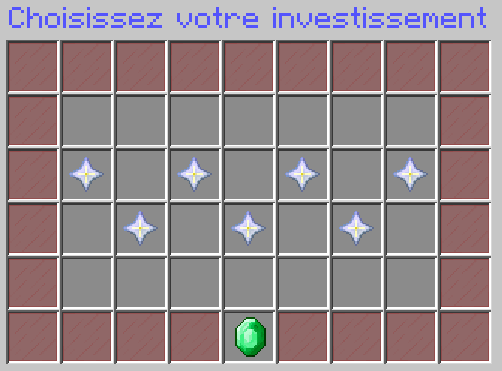
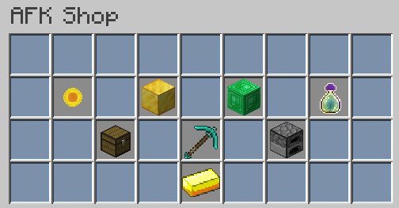

# Serveur AFK

### Le serveur dispose d'un serveur AFK car l'AFK sur son is est interdit. Pour pouvoir AFK, faites /invest sur le serveur AFK pour pouvoir commencer à AFK tranquillement:

Une fois avoir fini votre **/invest**, revenez sur le serveur avec le **/serveur skyblock**. Ensuite, vous allez gagner des AFK coins qui vous permettront d'acheter des items dans le **/afkshop**:

Le serveur reste constamment allumer alors pas de limite de temps pour AFK :D

