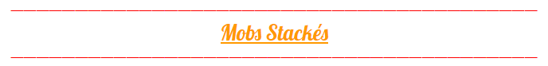

# Mobs Stackés

### Sur le serveur, les mobs ce stack automatiquement. Mais pour éviter les lags et garder nos 20 tps constant :D, voici la liste des mobs non stackable: 

* COW
* SHEEP
* RABBIT
* CHICKEN
* BEE
* PARROT
* SALMON
* VILLAGER
* DOLPHIN
* FOX
* LLAM
* OCELOT
* TURTLE
* COD
* DONKEY
* HORSE
* SNOWMAN
* TRADER\_LLAMA
* WANDERING\_TRADER
* CAT
* MULE
* PANDA
* WOLF
* IRON\_GOLEM

De plus, les mobs se stackent dans un rayon de 10 blocks, et la limite est de 30 mobs par stack. Les mobs ne se stackent pas dans la zone farming.

