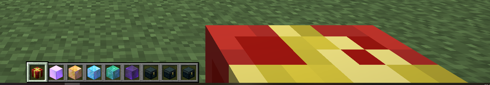

# Les Pouches

### **Les Pouches sont des Boxs spéciaux qui drop de manière aléatoire une quantité d'un même item. Par exemple, le DiamondPouch permet de droper entre 1 et 128 Blocs de Diamants.**

Il y a 9 types de Pouch pour le moment: 

* Exp
* Fer
* Or
* Diamant
* Emeraude
* Netherite
* Money T1
* Money T2
* Money T3

Pour les obtenir, ce sera dans les différents évents, quêtes ou sympathie des admins.  

