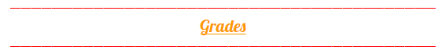

# Grades

### **Survivaliste :Le grade de base, avec comme commande:**

* /is \(border,info..\) Plus d’information sur la page “[_Liste de commande_](https://wiki.sky-dream.fr/iles/liste-des-commandes/commandes-joueur)”
* /bottle \(store,get \) max
* /sell all, h
* 1 sethome
* Accès à 1 Job
* Kit survivaliste

**Les autres grades sont achetable avec des tokens. /boutique** 

**Apres avoir acheter les tokens fait /tshop pour pourvoir acheter votre grade.**

### **Vip :Le grade VIP est le premier grade payant, il vaut 1500 tokens. Les avantages sont:**

* /craft
* /anvil
* /hat
* 3 sethomes
* Accès à 3 Jobs
* kit VIP

### **Vip+ :Avec le grade VIP+ à 3000 tokens vous avez accès aux avantages du grade VIP ainsi qu'à des nouveaux:**

* /fly
* /feed
* /heal
* /top
* /compact
* /walkspeed
* 5 sethomes
* Accès à 5 Jobs
* kit VIP+
* Pouvoir écrire en couleur dans les mp
* Limite de 10 slots dans l’HDV

### **Legendary : Le meilleur grade du serveur pour 7000 tokens donne les avantages des grades précédent plus quelque bonus:**

* /flyspeed
* /ptime
* /back
* /back
* /compass
* /uncondense
* /glow
* 10 sethomes
* Accès à 7 Jobs
* kit Legendary
* Limite de 20 slots dans l’HDV

