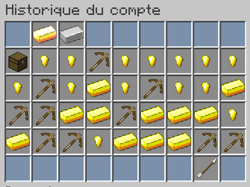

# Is Bank

### Le /is bank vous permet de stocker de la monnaie pour que les membres de votre is puissent l'utiliser. De plus, vous avez des intérêts de 5% de votre bank qui vous sont versés tous les jours. Pour voir les transactions et les investissements, faites /is bank statement:

Il y a aussi d'autres commandes:

* /is bank deposit MONTANT \| Déposer de l'argent dans l'is bank
* /is bank withdraw MONTANT  \| Retirer de l'argent de l'is bank
* /is bank balance  \| Afficher le solde de l'is bank

