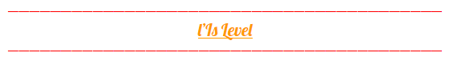
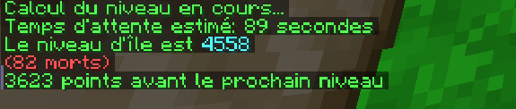
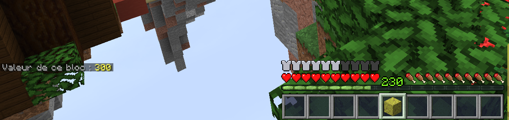

# Is level

### **Pour voir votre is level, faites la commande /is level et ça va calculer votre level d’is:**

L’end et le nether ne compte pas dans l'is level, de plus si vous mourrez vous perdrez des points \(à partir de 100 morts \(tous membres confondus\) vous perdez plus de points\). Voici quelque commande utile:

* /is top: donne le top 10 des joueurs qui ont le plus de level d'is
* /is value: donne la valeur d'un bloc en points:

