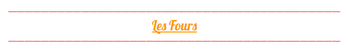
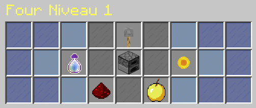

# Les Fours

### Le serveur a aussi des fours customs qui peuvent être level up en fessant cuire divers items ou avec de la money, de l 'xp. Pour voire l'interface des fours, faites click gauche:

En level up votre four, cela vous permettra de cuire les items plus vite et d'avoir un bonus de cuisson qui augmente au fur et une mesure.

**/!\ 2 BUG NOTABLE /!\**

* Si vous cassez votre four, il gardera son niveau mais pas sa progression.
* Si vous avez un four level " X " et que vous l'utilisez dans le craft du smoker/blastfurnace celui-ci reviens au level 1.

