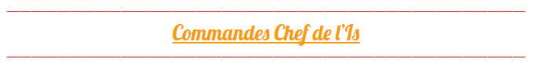

# Commandes Chef de l'Is

### Si vous êtes chef de votre is, vous aves aussi accès au commande de joueur. La liste des commandes du chef de l'is est ce que les chef peuvent faire en plus:

* /is setting: permet de configurer son is comme on le souhaite
* /is sethome: placer le point de spawn de son is
* /is team:

  * promote: pour  promouvoir un joueur de son is
  * trust: pour pouvoir trust une autre personne sur son is
  * setowner: permet de passer un joueur de son is chef \( vous êtes plus chef apres\)

  **/!\ BUG NOTABLE /!\ si vous passez un joueur de votre is chef et que vous avez fait des upgrades "**[**Les Différentes Upgrades**](https://wiki.sky-dream.fr/upgrade-fonctionnalite/les-differentes-upgrades)**" tout sera reset et il n'y a pas de remboursement.**

