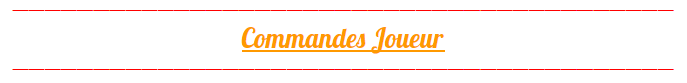

# Commandes Joueur

### Liste des commandes des joueurs:

* **/is**: vous téléporte sur votre is
  * **create**: commencer une is
  * **reset**: pour recommencer pour is
  * **team**:
    * **accept**: pour accepter de rejoindre une is
    * **leave**: pour quitter une is
    * **reject**: pour refuser une invitation d'is
  * **border**: enlevez ou ajoutez la bordure
  * **info**: pour connaître toutes les informations de l'is
  * **level**: pour actualiser le niveau de son is
  * **value**: \[block en main\]  pour connaître la valeur du block
  * **limits**  pour connaître les limites de block de son île
  * **chat:** pour parler seulement aux membres de l'is \( refaire la commande pour le désactiver \)
  * **biomes**:  pour changer de biomes
  * **near**:  pour connaître ces voisins
* **/block**:  permet de stocker tous ses minerais dans un chaudron \(VIP ou plus seulement\) 
* **/compact**: permet de transformer en blocks les objets dans votre inventaire \(LEGENDARY seulement\)
* **/bottle get**: mettre son expérience dans des bouteilles pour éviter de la perdre.

