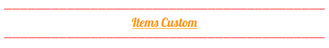
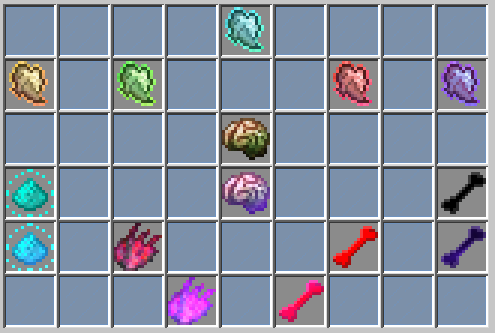
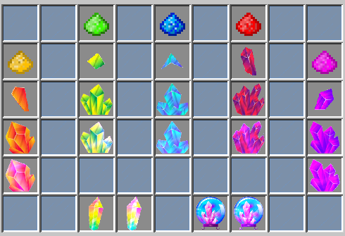

# Items Custom

Les Items custom sont à récolter dans la zone Farming qui est à déblocable. A voir sur la page “[Principe](https://wiki.sky-dream.fr/zone-farming/principe)” de la ZONE FARMING. Il y a 2 types d'items custom:

### **Loots Agressive :Il s'obtient en tuant certain mobs custom qui spawn dans la zone Farming:**

###  **Minerais Spéciaux :Les minerais custom s'obtiennent dans les bâtiments à minerais spéciaux, en cassant les blocs dans ces zones dédiées:**

