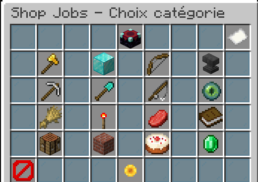
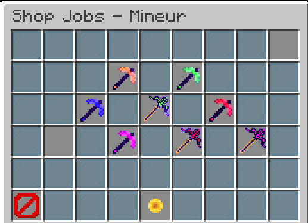

# Le jobs shop

Le jobs shop est un menu lié au jobs qui permet en augmenter ses métiers de débloquer des items custom ou plus exactement leurs crafts ou encore des fonctions précise.  
Voici quelques exemple : 

A vous de fouillez ce qu'il y a dedans, \(c.f page item custom\)  
Mais outre les items custom il y a des upgrade assez pratique, exemple :   
  
Au lvl 125 bucheron vous pourrez acheter le bucheron pro qui permet de casser un arbre géant ou tout arbre en soit de manière instant \(comme avec le mod veinminer\)  
  
Par ailleurs cette fonction de bucheron pro peut s'activer et désactiver à volonté une fois achetée avec la commande : /ut toggle

