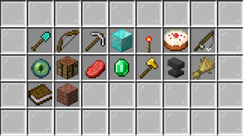
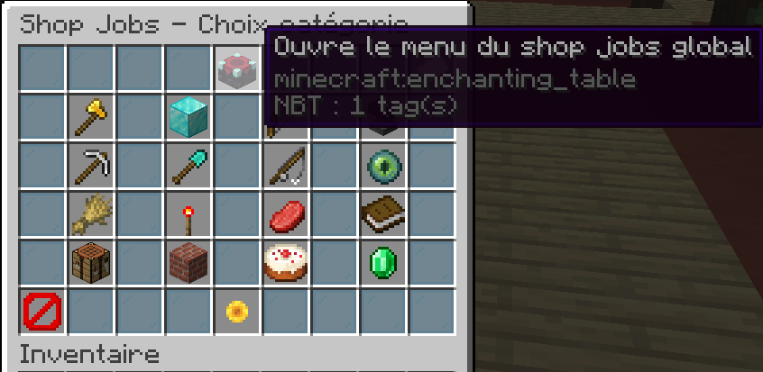

# Les Jobs et les commandes

Les jobs font partie intégrante du gameplay du skyblock. Sky-dream ne fait pas exception à la règle.   
Il y a 16 Jobs en tout : Terraformeur, Chasseur, Mineur, Builder, Technicien, Cuisinier, Pêcheur, Sorcier, Crafteur, Boucher, Trader, Bucheron, Armurier, Farmeur, Libraire et Macon.

Monter ses métiers permet d'avoir une source de revenu et de débloquer des crafts ou autres items via le jobs shop \(c.f. page sur les jobs shop\)  
  
Il est possible d'exercer qu'un seul métier en même temps, vous devez donc le quitter pour rejoindre un autre pour changer, mais ne vous inquiétez pas même si vous quitter un job vous ne perdrez rien.  
Cependant il est possible d'augmenter le nombre de jobs simultané : via les grades \(vip : 3; vip+ : 5; legendary : 7\) ou alors tous les 50 Lvl jobs global vous pouvez acheter dans le jobs shop l'upgrade correspondant en cliquant ici : 

Puis ensuite cliquer sur : Default. Il est possible d'avoir jusqu'à 9 métier simultanée.  
  
Voici une liste de commande lié aux jobs :   
- /jobs browse \(permet d'afficher le menu des jobs pour rejoindre les jobs avec clique droit ou voir la facon d'xp un jobs avec clique gauche ou quitter un métier avec clique molette\)  
- /jobs shop \(permet d'ouvrir l'interface du jobs shop \(c.f. page jobs shop\)  
- /jobs gtop \(permet d'afficher le classement des meilleurs joueurs en lvl jobs global\)  
- /jobs join "nom du job" \(autre facon de rejoindre un job\)  
- /jobs leave "nom du job" \(autre facon de quitter un job\)  
- /jobs info "nom du job" \(autre facon de voir comment pex avec un jobs\)  
- /jobs stats "nom du joueur" \(permet de savoir les lvl des métiers d'un joueur\)  
- /jobs top "nom du job" \(permet de voir les top joueurs d'un métier voulu\)  
  
Attention : Si vous faites /jobs gtop ou /jobs top faire 2x la commande : /fb toggle   
Oui 2 fois !!!!!

