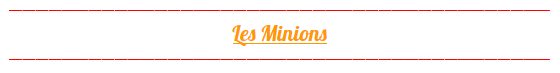
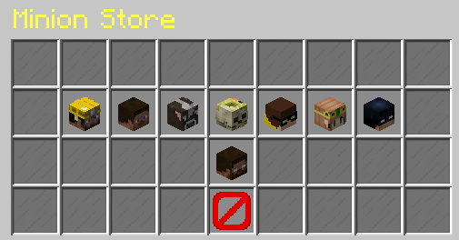

# Minions

Pour débloquer les minions, il faut augmenter vos levels de jobs. Une fois débloquer un minion faites **/Minion store** pour ouvrir le shop des minions. En tout il y a 8 Minions:

Chaque minion a différente spécialité qui peuvent être améliorer en level up vos Minions. Voici les spécialité et le prix du level up de chaque minion: 

* **Collector:**

  * Prix:
    * Level2: 1 Millions
    * Level3: 2 Millions
  * Radius:
    * Level1: 3x3x3
    * Level2: 5x5x5
    * Level3: 7x7x7

* **Farmer:**
  * Prix:
    * Level2: 300k
    * Level3: 1 Millions
  * Radius:

    * Level1: 4x4x4
    * Level2: 6x6x6
    * Level3: 12x12x12
* **Feeder:**

  * Prix:
    * Level2: 2 Millions
    * Level3: 4 Millions
  * Radius:
    * Level1: 3x3x3
    * Level2: 5x5x5
    * Level3: 7x7x7

* **Fisher:**
  * Prix:
    * Level2: 1 Millions
    * Level3: 2 Millions
  * Chance: \(1/4 chance d'avoir un poisson\)

    * Level1: 2
    * Level2: 3
    * Level3: 4
* **Bûcheron:**
  * Prix:
    * Level2: 5 Millions
    * Level3: 10 Millions
  * Radius:

    * Level1: 5x10x5
    * Level2: 7x15x7
    * Level3: 13x30x13
* **Mineur:**
  * Prix:
    * Level2: 1 Millions
    * Level3: 2.5 Millions
    * Level4: 5 Millions
    * Level5: 7.5 Millions
    * Level6: 10 Millions
    * Level7: 12.5 Millions
    * Level8: 25 Millions
    * Level9: 50 Millions
    * Level10: 100 Millions
    * Level11: 200 Millions
    * Level12: 300 Millions
    * Level13: 500 Millions
  * Settings: \(Nombre de Block que le minion peut casser\)
    * Level1: 2
    * Level2: 3 
    * Level3: 4 
    * Level4: 5 
    * Level5: 6 
    * Level6: 7 
    * Level7: 8 
    * Level8: 9 
    * Level9: 10 
    * Level10: 10 Enchante Smelt 
    * Level11: 10 Enchante Smelt + Fortune 1 
    * Level12: 10 Enchante Smelt + Fortune 3 
    * Level13: 10 Enchante Smelt + Fortune 5 
* **Seller:**
  * Prix:
    * Level2: 10 Millions
    * Level3: 50 Millions
    * Level4: 100 Millions
    * Level5: 500 Millions
  * Multiplicateur:

    * Level1: 1
    * Level2: 1.2
    * Level3: 1.4
    * Level4: 1.6
    * Level5: 2
* **Slayer:**
  * Prix:
    * Level2: 10 Millions
    * Level3: 100 Millions
  * Radius:

    * Level1: 3x3x3
    * Level2: 5x5x5
    * Level3: 9x9x9

#### Pour que votre minion travaille, vous devez lui donnez a manger ou de payer 200 SC. Voici la liste que les minions mange:

* Pain: 2 
* Pomme: 2 
* Steak: 4
* Saumon: 4
* Mouton cuit: 4
* Porc cuit: 4
* Poulet cuit: 4
* Pomme d'or: 10 
* Pomme d'or enchante: 20 

\*\*\*\*

  

