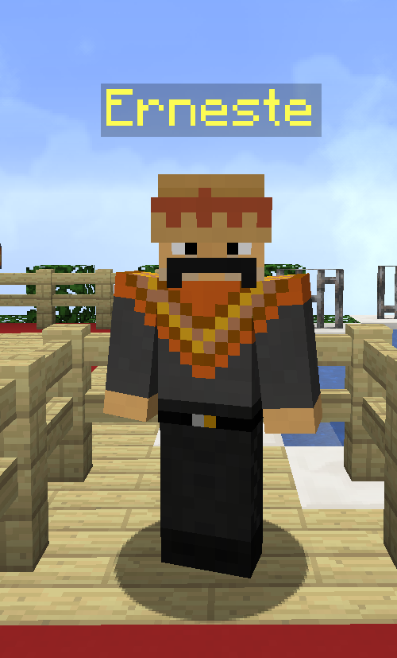

# Quests

### Le serveur met à disposition différente quêtes qui vont de 1 à 17, ces quêtes sont de plus en plus dures et vous permettent d'explorer la zone farming. D'autres quêtes seront ajoutées dans le futur.

Pour avoir accès à la première quête, vous devez monter votre SkyGrade à FARMEUR. Ensuite, vous devez trouver Erneste qui est caché dans le spawn:

Après avoir fait les 5 premières quêtes, chercher un grand portail au spawn qui vous permettra de passer dans la zone farming:

Il y a différentes commandes pour vous aider dans vos quêtes:

* /quest: Permet de voir la quetes en cours
* /quests journal : Fait apparaitre un journal avec la quete en cours 
  * Pour faire disparaitre le livre, re faire le /quests journal

