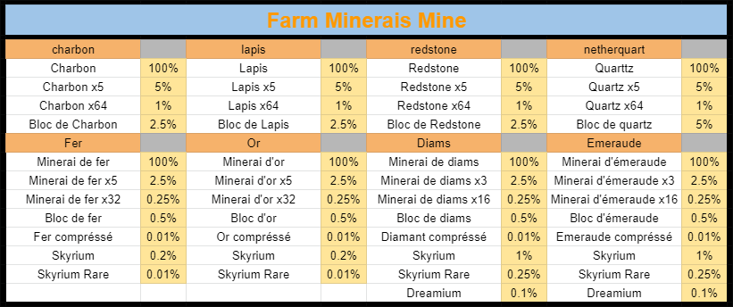
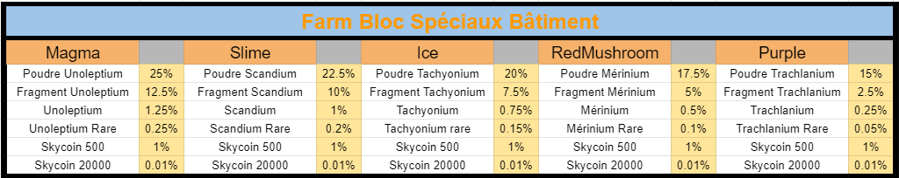
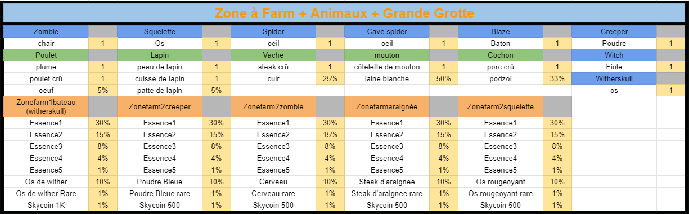

# Les Zones à Farm

### **Dans la zone Farming, il y a des zones spécifiques cachées pour avoir des minerais, des items customs et des loots customs:**

En premier, il y a les minerais qui sont éparpiller un peu partout dans la mine, voici le tableau des taux de drop:

Ensuite, les blocs spéciaux sont dans des bâtiments, ils servent à craft différents outils de jobs: 

Pour finir, les loots customs sont dropés par des monstres plus ou moins fort dans différents endroits de la zone + les animaux sont dans une grange aussi cacher :

