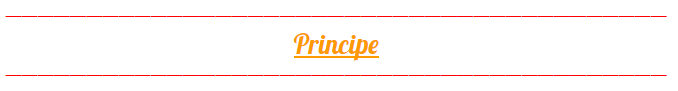
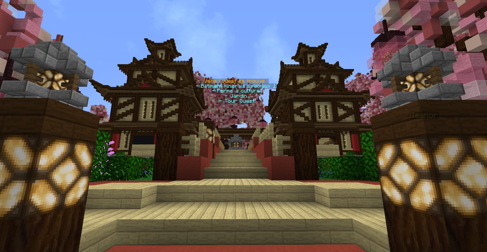

# Principe

### La Zone Farming, est une autre map à part du skyblock, qui vous permet de farm différents items customs, avoir des défis et un peu de RP.

Pour y accéder, il faut être sg Farmeur. \(["Skygrade & Challenges Secondaires](https://wiki.sky-dream.fr/upgrade-fonctionnalite/skygrade-and-challenges-secondaires)"\). Une fois Farmeur, il y a 5 Quêtes à faire \("[Quest](https://wiki.sky-dream.fr/upgrade-fonctionnalite/quests)"\). A la fin de ces 5 quêtes, vous devez trouver le portail qui se trouve au spawn pour aller dans cette zone farming:

Il existe également une orb farming qui permet de s'y tp direct. Pour l'obtenir, vous devez parler un pnj dans la Zone :D

